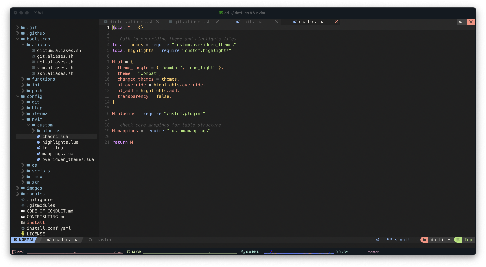

# Dotfiles

[](https://github.com/monlor/dotfiles/actions)

**Warning**: Don’t blindly use my settings unless you know what that entails. Use at your own risk!

* The environment with brew and pacman is recognized as a local development environment, and a full set of software packages will be installed.
* The presence of apt and yum is recognized as a server environment, and only the basic terminal environment is configured.

## Shell setup (macOS)

- [Dotbot](https://github.com/anishathalye/dotbot) - a tool that bootstraps dotfiles
- [Oh My Zsh](https://github.com/robbyrussell/oh-my-zsh) - framework for managing `zsh` configuration
- [Powerlevel10k](https://github.com/romkatv/powerlevel10k) - theme
  - [Meslo Nerd Font](https://github.com/romkatv/powerlevel10k#meslo-nerd-font-patched-for-powerlevel10k) Meslo Nerd Font patched for Powerlevel10k

### Required

#### Mac

* brew [`make brew_install`]
* git [`xcode-select --install`]

#### Linux

* sudo
* git

### Installation

```bash
git clone https://github.com/monlor/dotfiles ~/.dotfiles --recursive
cd ~/.dotfiles
./install.sh
```

### Custom

* ~/.zshrc.user
* ~/.gitconfig.user (Set up your git user)

### Inspired By

- https://github.com/denolfe/dotfiles
- https://github.com/craftzdog/dotfiles-public
- https://github.com/fisenkodv/dotfiles

## License

MIT
